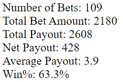

## So what's new?
Season 2 started off with a continuation of UBI at noon EST on Monday. UBI did *not* occur during the offweek from Monday through Sunday. The first UBI of Season 2 was just the usual 100 chips and 20 votes. Notably, 100 chips is *not* enough to bet the maximum 20 chips per game, so fans who didn't convert all of their chips into votes for the Season 1 elections got a jump start on betting in Season 2. I would expect that to continue in future seasons, so withhold some chips on election day if you want to maximize your earnings in the future! That's 140 chips minimum, or more if you want to stockpile enough chips to bet on multiple days right from the start.

The only new economic event in Season 2 came in the form of Double Down Thursdays! Fans were scheduled to receive double the usual UBI on Thursday. However, due to a temporal anomaly (or perhaps someone in the Commissioner's office sitting on the button), we got Quadruple Down Thursday instead. That's 400 chips and 80 votes! I would expect only double on future Thursdays.

## Unbalanced checkbooks?
Speaking of the temporal anomaly, I would be remiss if I didn't mention that a number of people have claimed some of their bets were "eaten". Let me tell what I've been able to determine for sure. Sometimes bets don't pay out when they are expected. In most cases bets would pay out within 1-2 hours after games ended. In some cases it took much longer. Importantly, it usually takes a full refresh of the webpage to update your chip count, so try that first if you think you should have more. One unique cause of chips going missing was when spillover caused the betting page to bug out. There are number of somewhat credible reports of people calculating a discrepancy in their chip totals vs. what they should have received. This is certainly discouraging if it happened to you. The unscheduled long siesta between seasons two and three should hopefully remedy the problems that led to these issues.

## Fans make great tools!
I want to highlight one person's tool that can help tally your total bets placed, total earnings, and more! **TransatlanticFoe** on Discord made this great [Blaseball Bets Tool](https://lgmbldm.github.io/blaseball-bet-stats/). To use it, first click the "generate links" button at the top to generate 6 links that poke the Blaseball api. Click each of those links and past the full block of text you see from each link into the six boxes. Lastly, click the "then click this" button and voila! Note: This does *not* contain any identifying information, so your privacy is safe!

At the time of writing this post, the links don't contain any data, but hopefully they will behave as expected once this unscheduled siesta is over.

## That's all for now!
I'll be back with another blog post before the start of Season 4!